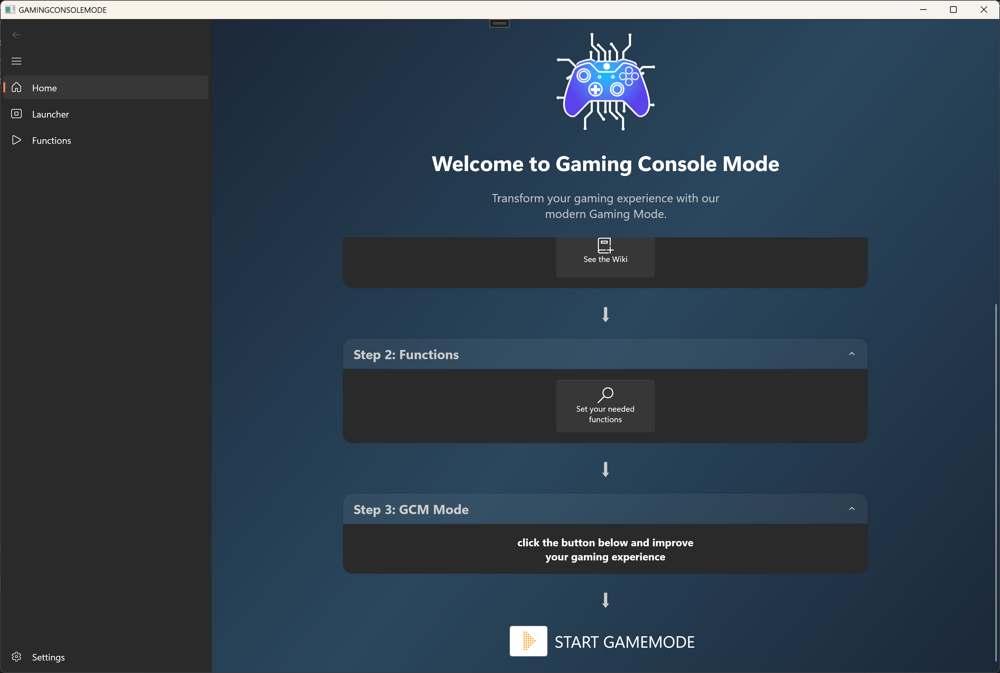
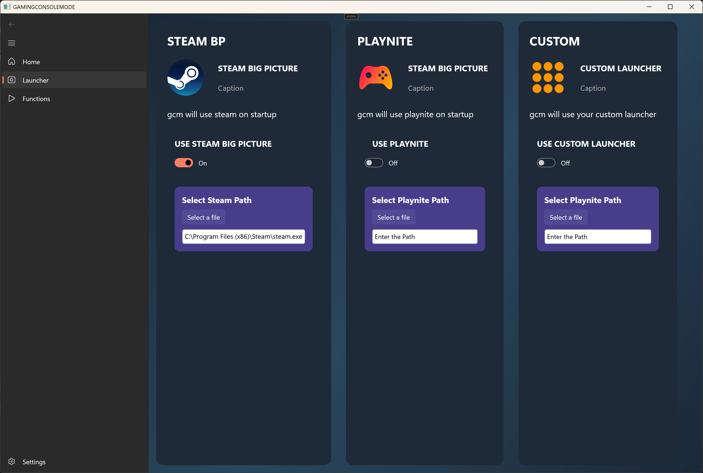
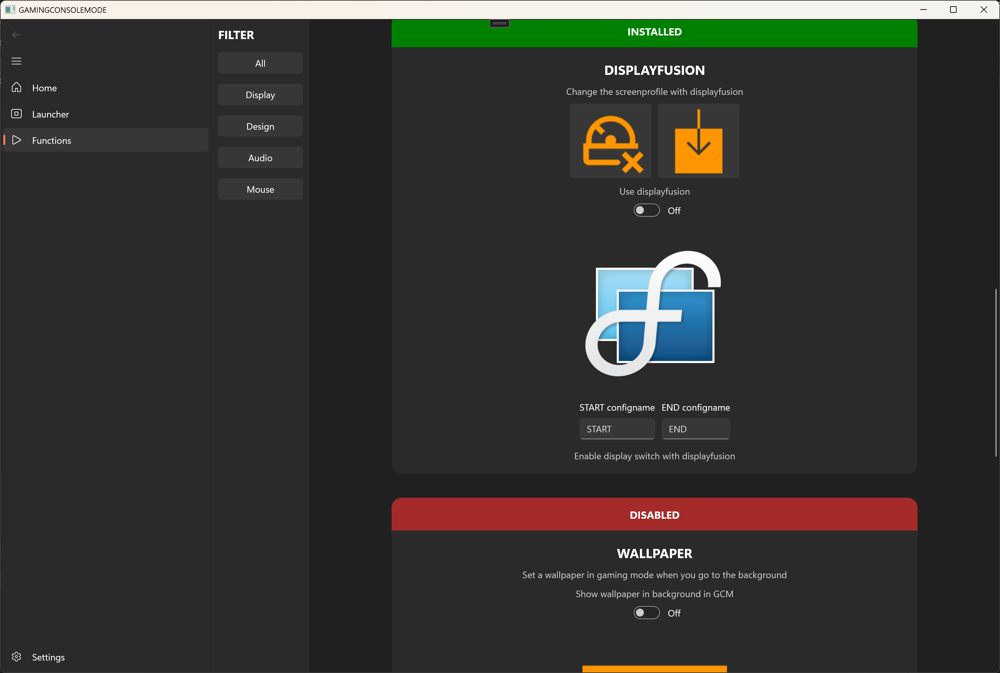
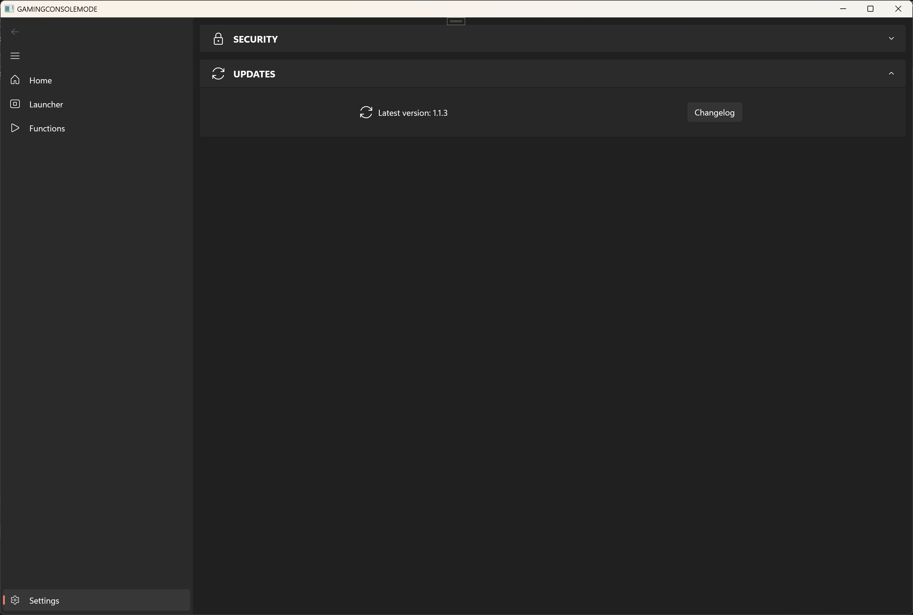
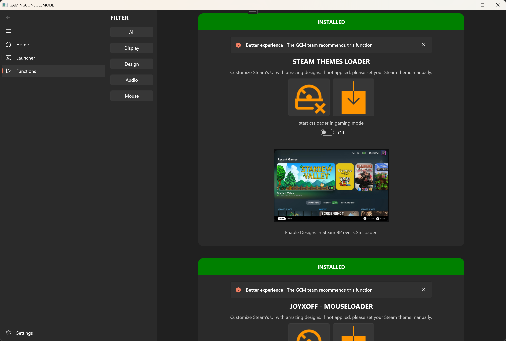
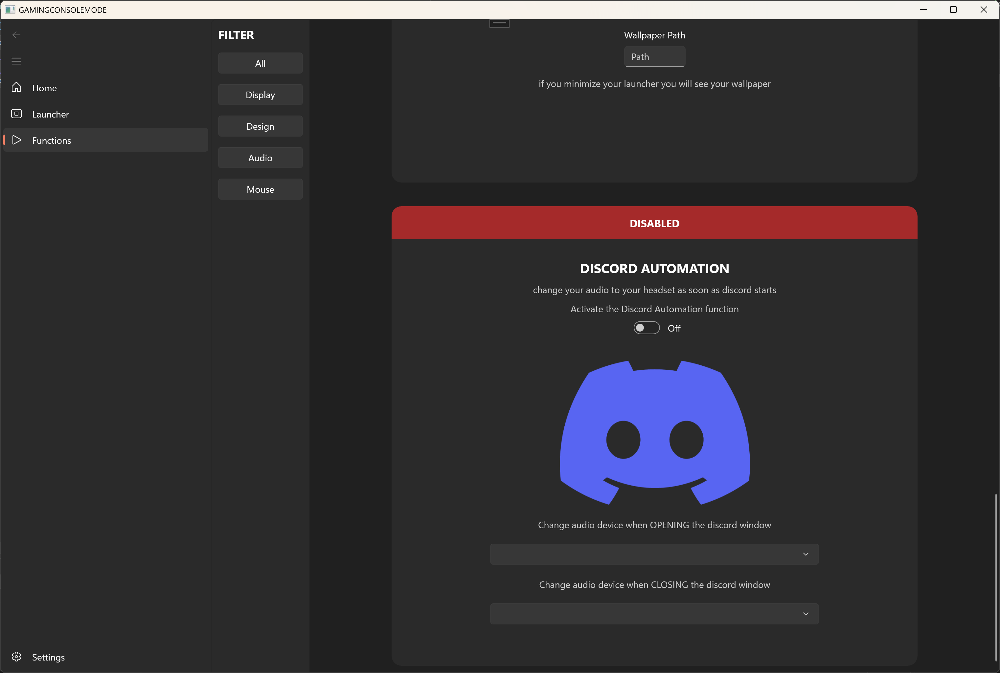

# GameConsoleMode (GCM) 🎮

**GameConsoleMode** (GCM) is a powerful C# application built with **WinUI 3**, designed to transform your PC into a fully functional gaming console while retaining the flexibility of the Windows operating system. GCM temporarily replaces the Windows shell with a custom gaming environment, providing a seamless console-like experience.

Whether you're a Steam enthusiast, a Playnite user, or prefer your own custom launcher, GCM offers a streamlined gaming experience without unnecessary Windows distractions.

Something like **SteamOS**, but powered by the **Windows engine**.

|  |  |
|--------------------------------|--------------------------------|
|  |  |

---

## ⚠️ Important Notice

- This software modifies critical parts of the Windows environment, including the registry.
- Use it **at your own risk**, as improper use or unexpected issues could impact your system.
- The developer assumes no responsibility for any damages or data loss resulting from the use of this software.
- It disables **User Account Control (UAC)** for a smoother experience, though this reduces security. (Only inside the gamemode)

---

## ✨ Features

### 🌟 Core Functionalities

#### **1. Shell Replacement**
GCM replaces the Windows Explorer shell with its own interface, hiding the Windows desktop, taskbar, and other elements, creating a pure gaming environment.

#### **2. Support for Multiple Launchers**

- Seamlessly integrates with popular launchers like:
  - **Steam**
  - **Playnite**
  - Custom launchers
- Automatically launches the configured game launcher on startup.

#### **3. Many Functions**

- Functions like:
  - **CSSLOADER**
  - **JOYXOFF**
  - **WALLPAPER**
- and many more to come...

---

## 🚀 Latest Features and Improvements

#### **1. Decky Loader Integration**
- Decky Loader is now supported and will be detected during GCM startup for a smoother plugin experience.

#### **2. Preload List for Apps & Files**
- You can now define a preload list for any kind of application or file that should be launched alongside GCM — full flexibility for your setup.

#### **3. Password-Free GCM Auto-Start**
- A new option under **Settings** allows GCM to launch at system startup without requiring a password — ideal for fast access on personal devices.

#### **4. Background Task Manager**
- A new background task manager is included, allowing you to:
  - Launch games or apps that run in the background.
  - Switch between them more easily.

#### **5. Controller Shortcuts**
- Controller shortcuts can now be used for quick actions, like:
  - Switching the current sound output device.
  - Showing performance overlays (e.g. NVIDIA or AMD).
- 🔜 In future releases, users will be able to assign their own custom controller shortcuts.

#### **6. Audio Device Switching**
- Automatically switch to a selected audio output device when GCM starts.
- Optionally switch back to your previous device when GCM closes.

#### **7. New “Links” Tab**
- A dedicated **Links** tab collects external apps/tools that are not yet integrated into GCM — all in one place for easier access.

#### **8. Onboarding System**
- New users are now guided through a simple onboarding process.
- Makes the first-time setup experience smoother and more intuitive.

#### **9. Flow Launcher Integration (Optional)**
- **Flow Launcher** is now optionally available for keyboard users.
- Launch apps without needing to switch to Windows mode.
- 🎮 In future updates, a controller-based app launcher is also planned.

---

🙋‍♂️ **Found a bug or have a feature request?**  
Feel free to reach out anytime via [GitHub Issues](https://github.com/Kosnix/GameConsoleMode/issues) or join our [Discord Server](https://discord.gg/xGD2GV6zS2) to share your feedback and ideas!

---

## 🫠 Configuration

### **Using `GCM SETTINGS`**
To configure GameConsoleMode, follow these steps:

1. Launch `GCM SETTINGS` after the installer. 
2. Configure the following options:
   - **Launcher Settings (Steam is standard)**:
     - Choose your preferred launcher (Steam, Playnite, or a custom executable).
     - Specify the file path to your game launcher.
   - **Additional Features in Functions**:
     - Enable or disable advanced features like CSS Loader or DisplayFusion integration.
3. Save your changes and start GCM at the Home Tab.

---

## 🖼️ Functions Interface

Below are screenshots of the Functions interface for better clarity:

  
  

---

## 🚀 Usage Guide

### **1. Launching GCM**
- Run the `GCM MODE` application.
- GCM will initialize, verify required files, and configure logging.

### **2. Entering Gaming Console Mode**
- Once GCM starts, the Windows interface will be hidden.
- Your configured game launcher will launch automatically.

### **3. Immersive Gaming**
- Enjoy your games without Windows interface distractions.
- GCM handles all necessary system adjustments for a seamless experience.

### **4. Returning to Windows**
- Close your game launcher, and GCM will automatically restore the Windows desktop environment.

---

## 🤝 Contributing

GameConsoleMode is open to contributions from the community.
- Special thanks to **toonymak1993** for active participation and valuable contributions.
- To contribute:
  - Submit **issues** for bug reports or feature requests.
  - Open **pull requests** with proposed improvements or fixes.

---

## 📞 Contact

For inquiries or support, reach out via Discord: **`.kosnix`** or **`.Toonymak`**  
Join our Discord server: [**GameConsoleMode Discord**](https://discord.gg/FbjYDeEJce)

---

GameConsoleMode continues to evolve, bringing new features and improvements with each release.  
Try it out, and let us know how we can make it even better! 🎉
